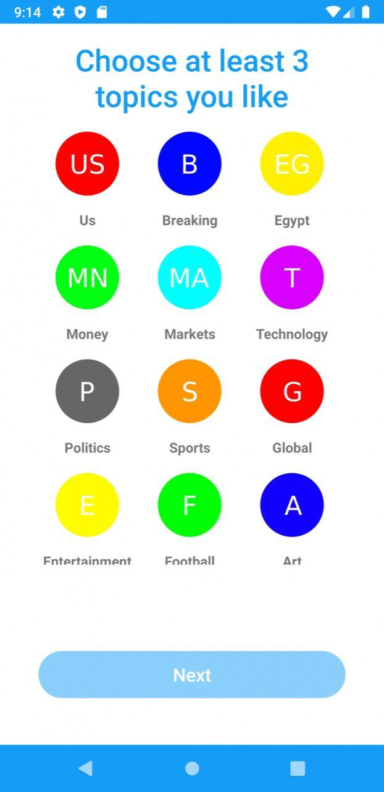

<!-- PROJECT SHIELDS -->
[![Contributors][contributors-shield]][contributors-url]
[![Forks][forks-shield]][forks-url]
[![Stargazers][stars-shield]][stars-url]
[![Issues][issues-shield]][issues-url]
[![MIT License][license-shield]][license-url]
[![LinkedIn][linkedin-shield]][linkedin-url]

<!-- PROJECT LOGO -->
 

  

<h3 align="center">Infinity News</h3>

  

<!--     <a href="https://github.com/ahmed-alllam/InfinityNewsAndroid">View Demo</a> -->
<!--     · -->
    <a href="https://github.com/ahmed-alllam/InfinityNewsAndroid/issues">Report Bug</a>
    ·
    <a href="https://github.com/ahmed-alllam/InfinityNewsAndroid/issues">Request Feature</a>
  

<!-- ABOUT THE PROJECT -->
## About The Project

**Infinity News is a Complete News Aggregator App where you can get latest News Posts from all of your favourite and most famous Sources and Magazines in one App**

### Features:

1. Get Latest News:  

   Get latest News Posts from all of your favourite and most famous Sources and Magazines in one App   

2. Keep Up-To-Date: 

   Keep Up-to-date with the Daily and Breaking News in your Area by using the Daily Recap Stories

3. Smart Searching: 

   Search By Title, Tags, Date and Keywords for all the News Posts and Stories that you need   

4. Get Notified Instantly: 

   Receive Notifications for Posts as soon as Published by Subscribing to news sources Push Notification    

## Screenshots

    
    
    
    
    
    

## Tech Stack

* 
* 
* 
* 
* 
* 
* 

<!-- CONTACT -->
## Contact

Ahmed Allam - [LinkedIn][linkedin-url] - ahmedeallam@aucegypt.edu

<!-- MARKDOWN LINKS & IMAGES -->
[contributors-shield]: https://img.shields.io/github/contributors/ahmed-alllam/InfinityNewsAndroid.svg?style=for-the-badge
[contributors-url]: https://github.com/ahmed-alllam/InfinityNewsAndroid/graphs/contributors
[forks-shield]: https://img.shields.io/github/forks/ahmed-alllam/InfinityNewsAndroid.svg?style=for-the-badge
[forks-url]: https://github.com/ahmed-alllam/InfinityNewsAndroid/network/members
[stars-shield]: https://img.shields.io/github/stars/ahmed-alllam/InfinityNewsAndroid.svg?style=for-the-badge
[stars-url]: https://github.com/ahmed-alllam/InfinityNewsAndroid/stargazers
[issues-shield]: https://img.shields.io/github/issues/ahmed-alllam/InfinityNewsAndroid.svg?style=for-the-badge
[issues-url]: https://github.com/ahmed-alllam/InfinityNewsAndroid/issues
[license-shield]: https://img.shields.io/github/license/ahmed-alllam/InfinityNewsAndroid.svg?style=for-the-badge
[license-url]: https://github.com/ahmed-alllam/InfinityNewsAndroid/blob/master/LICENSE.txt
[linkedin-shield]: https://img.shields.io/badge/-LinkedIn-black.svg?style=for-the-badge&logo=linkedin&colorB=555
[linkedin-url]: https://linkedin.com/in/ahmed-e-allam
[product-screenshot]: images/screenshot.png
